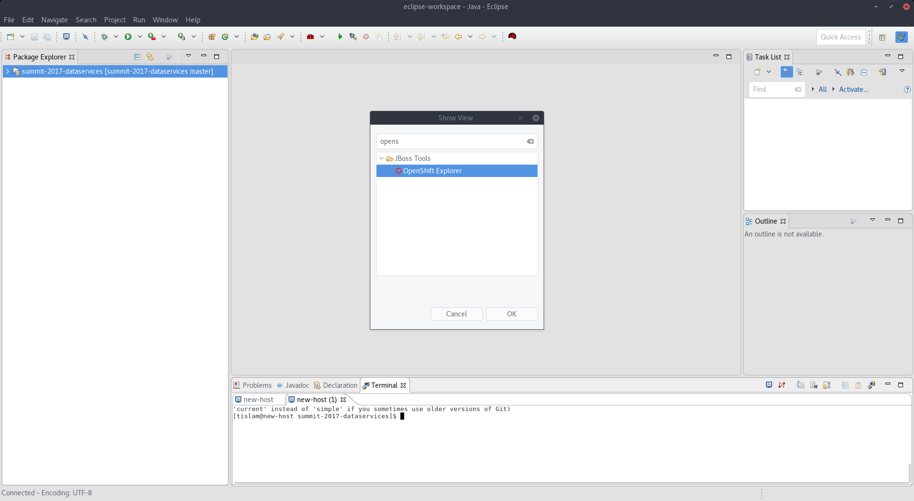
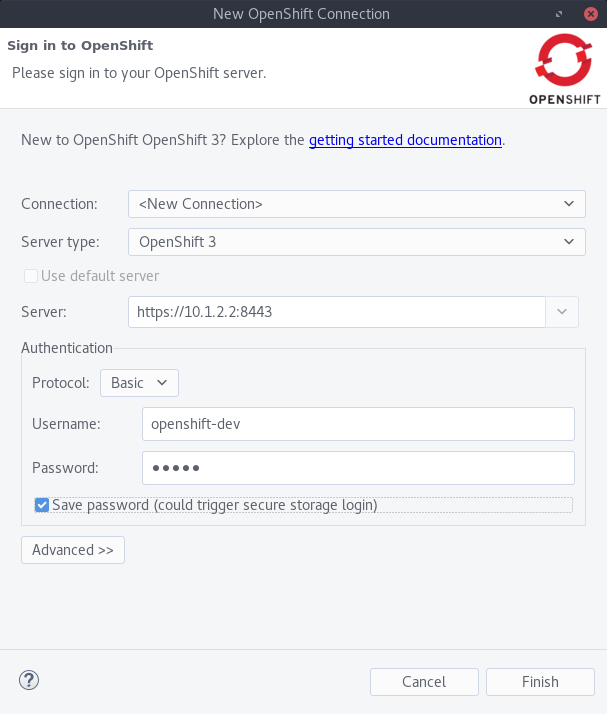
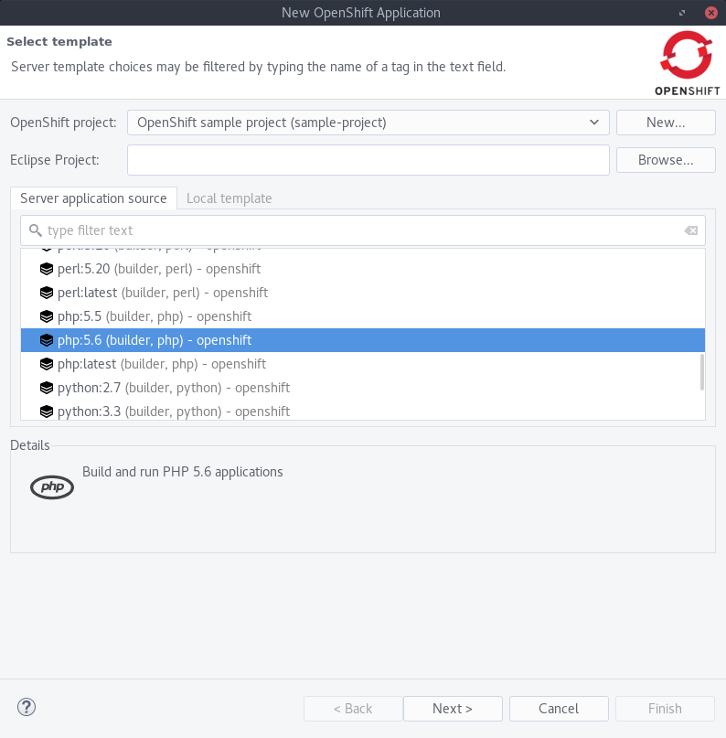
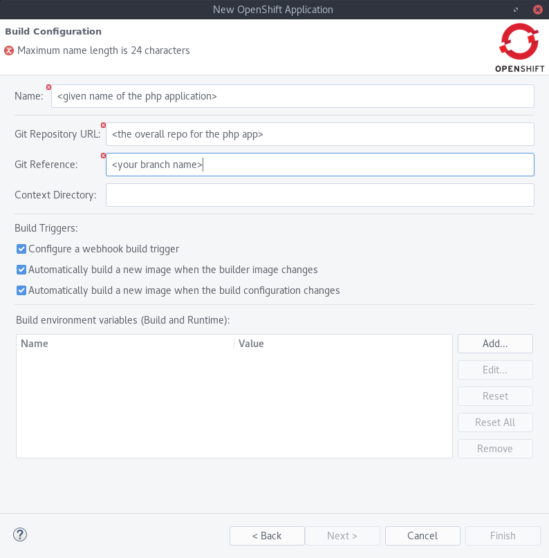
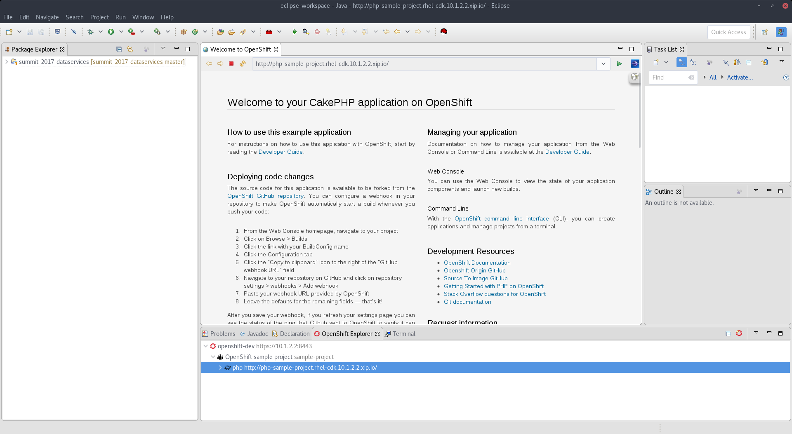

# 1. Performing a build and deployment of an application (IDE)

Before we begin, please import the php repo _(your specific branch!)_ locally into Eclipse.

1. In Eclipse, open up the OpenShift View

2. In the new view, click on the "New Connection Wizard" Link

3. Be sure that the `Server Type` field has a value of `OpenShift 3`

4. In the `Server` field, enter in the hostname of your master (in the CDK, this is just https://10.1.2.2) and specify `:8443` as the port.

4. In the Authentication section, select `Basic` for the Protocol.

5. Enter in your OpenShift username and password

6. Select the `Save Password` option and click `Finish`. If prompted, enter in your secure storage password for Eclipse to store the password.

7. You should now see a dropdown connection with a sample project. If you do not see a sample project, create one by right clicking on the connection, selecting `New >> Project` and filling the Project Name value.

8. Right click on your project and select `New >> Application`. Scroll down until you find the php 5.5 or 5.6 image and click `Next`.

9. In the next window, select a name for your PHP application and provide the Git repo URL. Additionally provide the Git Reference value. This is the name of your specific branch. Accept the rest of the defaults and click `Next`.

10. Review the default environment variables (and add your own if you want) on the next screen. If desired, specify the number of replicas (or instances) of your application that you want. Click `Next`.

11. Take note of the port mapping between the service that will be created and the pod(s). Accept the defaults on this screen and click `Next`.

12. Take note of the labels on the next screen. Labels are important in OpenShift for a number of reasons! Click `Finish`.

13. A window will open up asking if you would like to import the application's repo that you just deployed. Specify a destination if the default is not desired, and click `Finish`.

14. Right click on the URL that appears under your project and `Show In >> Web Browser` to view your app. Take note of the route URL.

#### Congratulations, you've deployed your application into OpenShift!
Your application is running in docker containers, orchestrated as pods by Kubernetes, and delivered as an enterprise platform in OpenShift.

At this point you can navigate the various resources of your deployment in the `Properties` view. If this is not already an open panel in your IDE: `Window >> Show View >> Properties (General)`.

[Back to Main Page](index.md)
