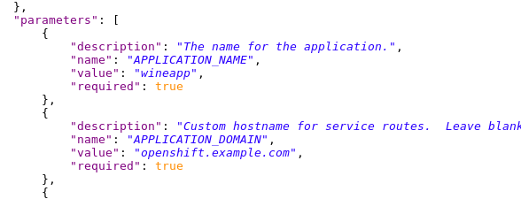
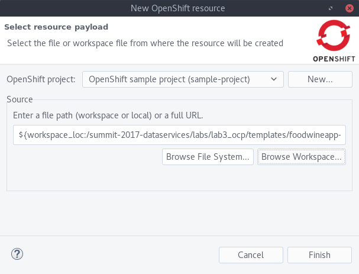
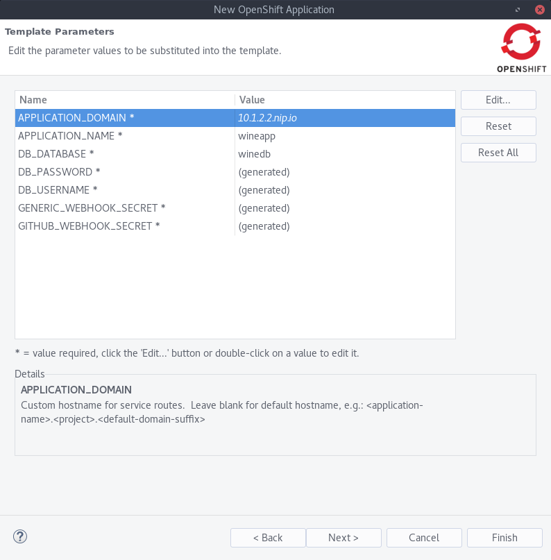
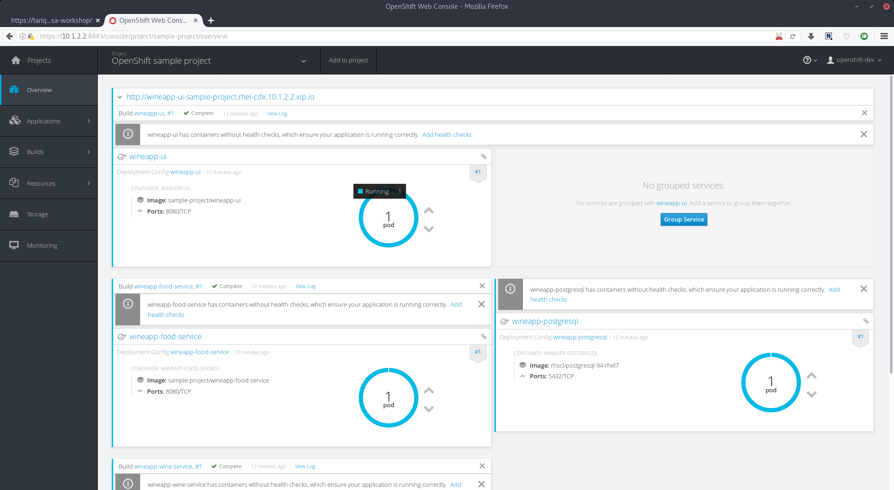
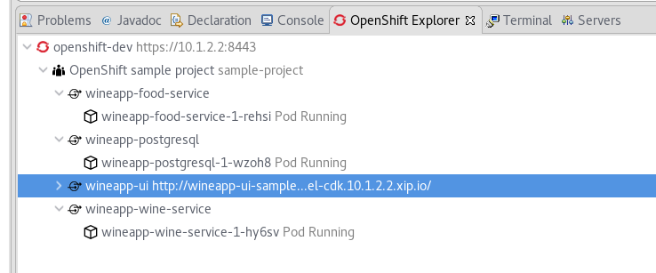
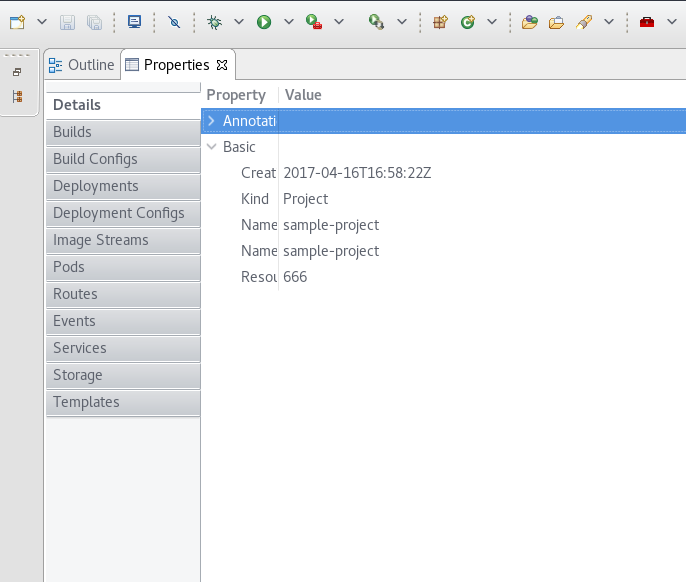
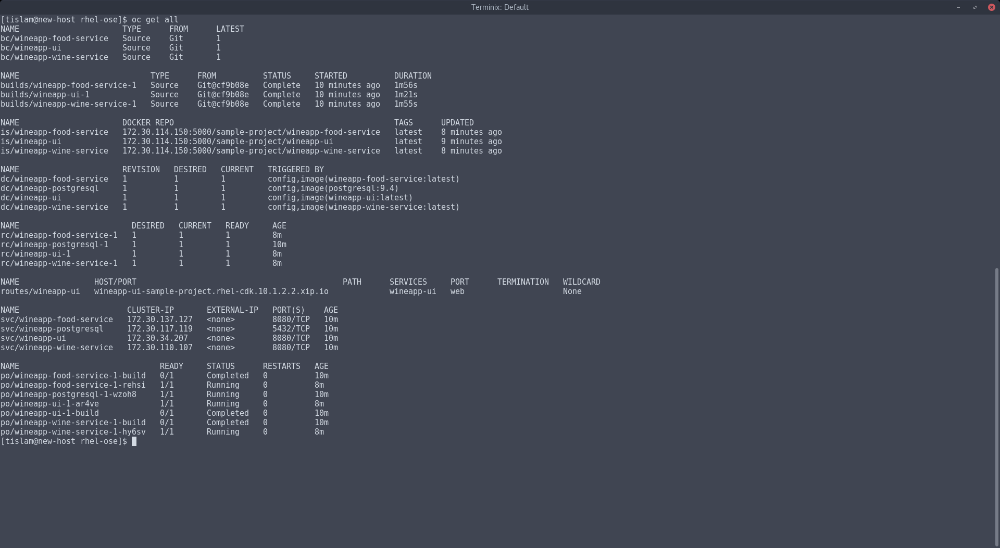

# Deploying The Microservices Application
### The power of templates

Before we begin, please import the microservices repo _(your specific branch!)_ locally into Eclipse.

There are a lot of directories but what we are going to concern ourselves with is the `./labs/lab3` and `./labs/lab3_ocp` directories.

## The Template
Looking at your repo branch, you should have a template. Let's open that up (`foodwine-template.json`) and explore it.

1. Edit the template. Look (CTRL+F) for `openshift.example.com`. It'll be near the top under the `parameters` stanza. Change the `parameters.description.value` for `APPLICATION_DOMAIN` to be whatever subdomain your OpenShift instance is using. For the CDK (for our purposes anyway), this is `10.1.2.2.xip.io`.


There are a couple of ways to deploy this:
#### CLI:
```
oc process -f labs/lab3_ocp/templates/foodwineapp-template.json | oc create -f -

```

#### Eclipse:
1. Right click on your project
2. Select `New >> Resource`
3. In the window that pops up, select `Browse Workspace`.
4. Navigate to `labs/lab3_ocp/templates/foodwineapp-template.json` and select it.
5. Click `Finish`


6. Back in the OpenShift Explorer view, right click on your project and select `New >> Application`
7. In the pop up window, scroll down until you find the `wineapp` template that you just imported. Click `Next`.
8. In the next window, select the `APPLICATION_DOMAIN` value and edit it. Change it to your OpenShift subdomain if not already done. For the CDK this is `10.1.2.2.nip.io`.


9. Click `Finish`

10. Click `Ok` in the resource creation confirmation window.

11. Click `Cancel` on the repo import pop up window as you have already imported your repo branch into Eclipse.

12. Explore your deployment either in the Web UI, Eclipse, or via the oc client. Find your comfort zone.








[Back to Main Page](index.md)
