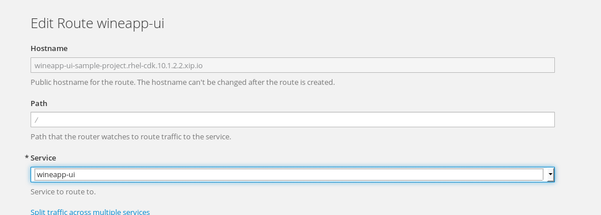

# Let's Get Creative.

In this lab you'll have the freedom to make whatever changes you wish through whichever mechanism you desire as we have covered today (Web UI, Eclipse, oc client). Don't forget to use rsync.

If you break your deployment in any way, simply run the following command and re-process the template:
```markdown

oc delete all --all --now

# Then from your local repo

oc process -f labs/lab3_ocp/templates/foodwineapp-template.json | oc create -f -
```
## Independent Exercises
1. Try to scale the independent services (ui, food, wine). What advantages does this give you?

### Attempt a blue-green or a straight rolling deployment:

#### Blue Green
1. Let's try the ui-service (wineapp-ui)
* Make a change to the ui-service (wineapp-ui), perhaps a simple HTML change that's easily noticeable
* Commit and push the change to your branch
* In the tooling of your choice, create a __new__ deployment of just the ui-service. The most important thing to remember here is to give it a new name, like `wineapp-ui-green`.
* Edit your route. Change the service that your route points to from `wineapp-ui` to `wineapp-ui-green`. In the yaml file this is the `spec.to.name` value.



* Now refresh your app in the browser. You will see your changes immediately.

#### Rolling deployment
1. After step 3 above, simply run the wineapp-ui build again:
```
oc start-build bc/wineapp-ui
```

### Kill a service pod
```markdown

oc get pods

# choose one of the service pods (ui, food, wine)
oc delete pod <podname> --now
```

Note the self-healing. Once the pod is back in place and started, note that your data is still preserved. Keep in mind that your Postgresql database is ephemeral so if you kill that, your data is gone.

[Back to Main Page](index.md)
